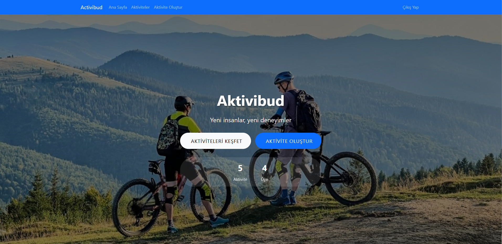
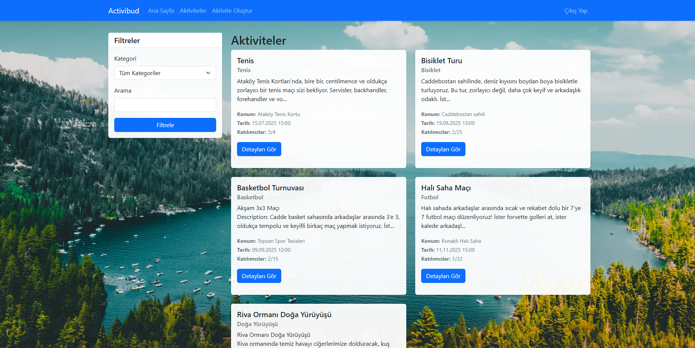

# Aktivite Arkadaş Bulma Sistemi

Aktivite Arkadaş Bulma Sistemi, **kullanıcıların çeşitli aktiviteler oluşturabileceği**, **katılabileceği**, **takip edebileceği** ve **yeni arkadaşlar edinebileceği** web tabanlı bir platformdur.  

Uygulamada **kullanıcılar var olan aktiviteleri görebilir**, **hesap oluşturup** bu aktivitelere **katılabilir**, ya da **kendi aktivitelerini oluşturabilirler**.  
Böylece kendi **ilgi alanlarına göre insanları bir araya getirebilir**, arkadaş çevrelerini genişleteebilir ve **yalnız vakit geçirmek yerine yeni dostluklar kurabilirler**.  
Tüm bunlar, **kullanımı oldukça kolay ve sade bir arayüz** üzerinden sunulmaktadır.

## 🌟 Özellikler

- 🔐 **Kullanıcı Yönetimi:**  
  - Kayıt Olma (Şifreler `password_hash()` ile güvenli bir şekilde saklanır)  
  - Giriş Yapma (PHP Sessions)  
  - Oturum Kapatma  

- 📅 **Aktivite Yönetimi:**  
  - Aktivite oluşturma (başlık, açıklama, kategori, konum, tarih/saat, maksimum katılımcı)  
  - Aktiviteleri listeleme, detayları ve katılımcıları görüntüleme  
  - Aktiviteyi düzenleme ve silme (sadece oluşturan)  

- 👥 **Aktivite Katılımı:**  
  - Oturum açanlar aktivitelere katılabilir ya da ayrılabilir  
  - Katılımcı sayısını ve maksimum kapasiteyi görebilir  

## 🏡 Ana Menü

Ana menüde, oluşturulan ve yakında gerçekleşecek aktiviteleri, kategorileri ve kendi oluşturduğunuz aktiviteleri rahatlıkla görebilirsiniz.

## 📁 Aktiviteler Sayfası

Aktiviteler sayfasında, belirli bir kategoriye göre ya da anahtar kelimeyle arama yapabilir, istediğiniz aktivitenin detaylarına ulaşabilir ve katılabilirsiniz.

## 📹 Tanıtım Videosu

[Videoya buradan ulaşabilirsiniz.]([https://www.youtube.com/](https://youtu.be/1ML2v-h8-PU))  
